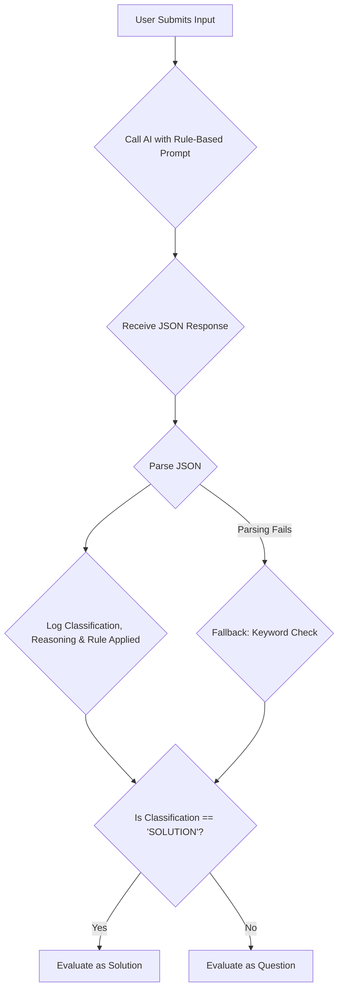

# Plan: AI Riddle Classification Overhaul - V2

## 1. The Problem

The current AI classification logic is not rigorous enough. It misinterprets information-gathering questions as solution attempts because the rules are too ambiguous. A "chain-of-thought" is a good start, but it doesn't guarantee compliance with a strict logical framework.

## 2. The Solution: A Rule-Based, Auditable Framework

I will implement a new system that forces the AI to adhere to a strict, hierarchical set of rules and to cite which rule it is applying. This moves from a "chain-of-thought" to a "chain-of-compliance" model.

### Part 1: The New Rule-Based Prompt

I will replace the existing prompt in `main.py` with a new, more rigorous prompt that includes a strict rule hierarchy.

**New Prompt Structure:**

```
You are a riddle classification expert. Your task is to analyze a user's input and classify it as either a "QUESTION" or a "SOLUTION" based on the following rule hierarchy. You must follow these rules in order.

**Riddle Context:**
- Riddle Answer: "{riddle_answer}"

**User Input:**
- "{user_input}"

**Rule Hierarchy (Apply in this order):**

**Rule 1: The Solution Identification Rule (Highest Priority)**
- If the user's input contains the exact answer ("{riddle_answer}") or a direct, unambiguous synonym, it is a **SOLUTION**, regardless of phrasing (question or statement).
- **Example:** For answer "A needle", inputs like "Is it a needle?", "a needle", "I think it's a sewing needle" are all SOLUTIONS.

**Rule 2: The Interrogative Intent Rule**
- If Rule 1 does not apply and the input is a question, determine its intent.
- **Confirmation Question:** If the question proposes a potential answer (that is not the correct one), it is a **SOLUTION** (an incorrect one). Example: "Is it a bicycle pump?"
- **Information-Gathering Question:** If the question asks about the properties, characteristics, or context of the riddle's elements, it is a **QUESTION**. Example: "Are the bicycles made of metal?", "Is the man a criminal?"

**Rule 3: The Declarative Intent Rule**
- If the input is a statement and Rule 1 does not apply, determine its intent.
- **Solution Statement:** If the statement proposes an answer (that is not the correct one), it is a **SOLUTION**. Example: "The answer is a bicycle pump."
- **Commentary Statement:** If the statement is a comment about the riddle itself, it is a **QUESTION** (as it is not an attempt to solve). Example: "This riddle is hard."

**Analysis and Output:**
1.  **Rule Application:** Explicitly state which rule you are applying and why.
2.  **Final Output (JSON format only):** Return a single, valid JSON object with three keys:
    - `classification`: Must be either "QUESTION" or "SOLUTION".
    - `reasoning`: A brief explanation of your conclusion.
    - `rule_applied`: The specific rule you used (e.g., "Rule 2: Interrogative Intent").
```

### Part 2: Structured JSON Output with Rule Citation

The AI's output will now include a `rule_applied` field, making its decision-making process fully transparent.

**Example Output:**

For the input "Are they actually bicycles?":
```json
{
  "classification": "QUESTION",
  "reasoning": "The user is asking an information-gathering question to clarify the nature of an object in the riddle. It does not contain the answer, so Rule 1 does not apply. This falls under Rule 2 as an Interrogative Intent question.",
  "rule_applied": "Rule 2: Interrogative Intent"
}
```

### Part 3: Smarter Backend Logic in `main.py`

I will update the `process_riddle_submission` function to:
1.  Parse the new JSON response.
2.  Log the `classification`, `reasoning`, and `rule_applied`.
3.  Use the `classification` field to route the logic.
4.  Add a fallback that can use the `rule_applied` to make a more informed decision if the AI's response is malformed.

## 3. Visual Flowchart

This Mermaid diagram illustrates the new, rule-based classification process:



This new system will be far more accurate, auditable, and robust. It forces the AI to comply with a logical framework, rather than just interpreting intent.