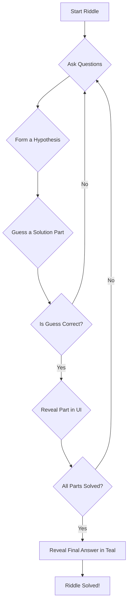

# Plan: Multi-Part Riddle Solutions - V3

## 1. The Problem

Hard riddles often have multi-part answers, but our current system only supports a single string solution. This makes it impossible to track progress on complex riddles and provide a satisfying user experience.

## 2. The Solution: A Multi-Component Framework

I will implement a new system that treats solutions as a list of components. This will involve changes to the AI, the backend data models and logic, and the frontend UI.

### Part 1: AI and Data Structure

**(No changes from the previous plan)**

### Part 2: Backend Logic

**(No changes from the previous plan)**

### Part 3: Frontend UI/UX

**3.1. New "Solution Progress" Section (`page.tsx`)**
This new section will be placed directly **below the riddle text** and **above the question history**.

**3.2. Dynamic Updates**
- As the user correctly guesses a component, the corresponding placeholder in the "Solution Progress" section will be filled in.
- Once all components are solved, the full, one-sentence solution summary will appear at the bottom of the "Solution Progress" list, styled in the branded teal color.

**UI Mockup Flow:**

**Initial State:**
```
+---------------------------------------------------+
|                  Today's Riddle                   |
|   A man is found dead in the desert, naked...     |
+---------------------------------------------------+
|                 Solution Progress                 |
| +-----------------------------------------------+ |
| | [ Part 1 of 4 ]                               | |
| +-----------------------------------------------+ |
| | [ Part 2 of 4 ]                               | |
| +-----------------------------------------------+ |
+---------------------------------------------------+
|                  Question History                 |
| - Is he alone? -> No                              |
+---------------------------------------------------+
| [ Type your question or guess here... ] [ Submit ] |
+---------------------------------------------------+
```

**Final Solved State:**
```
+---------------------------------------------------+
|                  Today's Riddle                   |
|   A man is found dead in the desert, naked...     |
+---------------------------------------------------+
|                 Solution Progress                 |
| +-----------------------------------------------+ |
| | The man was in a hot air balloon with others. | |
| +-----------------------------------------------+ |
| | The balloon was losing altitude...            | |
| +-----------------------------------------------+ |
| | ...                                           | |
| +-----------------------------------------------+ |
| | <div style="color: teal;">The man was in a... | |
| +-----------------------------------------------+ |
+---------------------------------------------------+
|                  Question History                 |
| - He was in a hot air balloon -> Correct!         |
+---------------------------------------------------+
| [ Riddle Solved! ]                          [ ✓ ] |
+---------------------------------------------------+
```

## 4. Visual Flowchart of User Journey

This updated Mermaid diagram illustrates the complete user journey, including the final answer reveal.



This final plan provides a complete and satisfying user experience for solving complex, multi-part riddles, with a clear and intuitive visual layout.