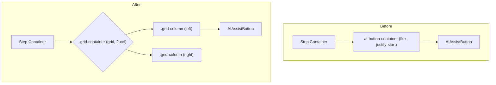

## UI Alignment Plan

### 1. The Problem

The `AIAssistButton`s, italicized text, and text boxes are not consistently left-aligned across all steps of the Session Wizard. The root cause is the use of different HTML structures and CSS classes for each step's layout.

*   **Step 1 (`Why do you think this problem is happening?`)** uses a CSS grid (`cause-assumption-pair`), which correctly aligns the buttons and text boxes.
*   **Steps 2, 3, and 4** use a flexbox container (`ai-button-container`) that aligns the buttons to the start of the container, not in relation to the text boxes above them.
*   The italicized text (`.step-description`) is center-aligned, but should be left-aligned.

### 2. The Solution

I will standardize the layout across all steps by using a consistent grid-based structure and updating the CSS.

#### Step 1: Standardize the CSS

I will modify `frontend/src/app/globals.css` to ensure all necessary layout containers are available and correctly styled.

1.  **Create a new reusable class for single-column layouts within the grid.** This will be used for steps that only have one AI button.
    ```css
    .grid-container {
      display: grid;
      grid-template-columns: 1fr 1fr;
      gap: 10px;
      width: 100%;
    }

    .grid-column {
      display: flex;
      flex-direction: column;
      gap: 5px;
    }
    ```
2.  **Update the `.step-description` class to be left-aligned.**
    ```css
    .step-description {
      font-style: italic;
      font-size: 14px;
      margin-bottom: 1rem;
      text-align: left; /* Changed from center */
    }
    ```

#### Step 2: Refactor the Component Structure

I will update `frontend/src/app/SessionWizard.tsx` to use this new standardized grid structure for the AI buttons in all relevant steps.

Here is a visual representation of the change:



*   **For Step 2 ("If you were to perpetuate the problem...")**: The single `AIAssistButton` will be placed in the left column of the new grid structure.
*   **For Step 3 ("What can you do about it?")**: The `AIAssistButton` will be wrapped in the new grid structure.
*   **For Step 4 ("What worries you?")**: The `AIAssistButton` will be wrapped in the new grid structure.

This approach will ensure that all specified elements are perfectly aligned to the left, using the text boxes as the standard, creating a cleaner and more consistent user interface.