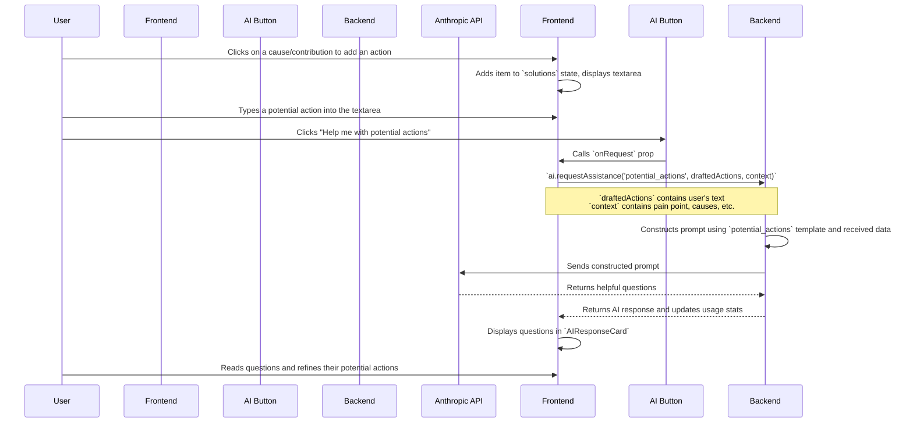

# AI Button Fixes Plan

This document outlines the plan to fix the "Help me with potential actions" AI button in Step 3 of the Session Wizard.

## The Problem

The AI button in Step 3 is misconfigured. It's supposed to help the user brainstorm potential actions, but instead, it's incorrectly trying to suggest more *causes*. This leads to two main issues:
1.  It doesn't provide the intended assistance to the user.
2.  It fails to send the user's drafted actions to the backend, causing an error.

## The Goal

The goal is to refactor the feature so that it correctly analyzes the user's drafted actions and provides helpful, context-aware questions to stimulate deeper thinking.

## The Plan

The plan involves changes to both the backend and frontend code.

### 1. Backend Update (`api/services/aiService.js`)

-   **Rename the AI Stage:** The `suggest_causes` stage will be renamed to `potential_actions` to accurately reflect its new purpose.
-   **Rewrite the AI Prompt:** The prompt for this stage will be rewritten. The new prompt will instruct the AI to act as a coach, asking open-ended questions based on the user's problem statement, selected causes, and drafted actions.

### 2. Frontend Component Update (`frontend/src/components/AIComponents.tsx`)

-   **Update Stage Name:** The `AIAssistButton` component will be updated to use the new `potential_actions` stage name.
-   **Update Description:** The button's tooltip/description will be updated to align with its new functionality of helping the user brainstorm actions.

### 3. Frontend Wizard Update (`frontend/src/app/SessionWizard.tsx`)

-   **Use New Stage:** The `AIAssistButton` in Step 3 will be configured to use the `potential_actions` stage.
-   **Send Correct Data:** The request sent to the AI will be modified to include the user's drafted actions in the `userInput` field. The context will also be updated to include the relevant causes or contributions.
-   **Improve UI Logic:** The button's `disabled` state will be updated to ensure it's only enabled when a cause has been selected and the user has started typing an action.
-   **Clean Up Obsolete UI:** The "Suggested Causes" chip display will be removed from Step 3, as it is no longer relevant. The AI's response (a set of questions) will be displayed in the standard `AIResponseCard`.

### Data Flow Diagram

This diagram illustrates the corrected data flow:

This plan will resolve the error and create a more intuitive and helpful user experience.