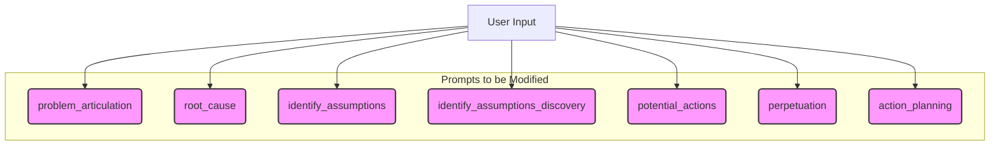

# AI Prompt Refinement Plan

My objective is to refine the AI prompts to eliminate the unnecessary summarization of your inputs, ensuring the AI's responses are more direct, analytical, and respectful of the information you've already provided.

## Analysis of the Problem

The core issue is located in the prompt templates within [`api/services/aiService.js`](api/services/aiService.js). Several prompts for different conversational stages instruct the AI to begin its response by restating information you've already given. This results in the repetitive conversational pattern you've identified. My plan is to remove these introductory summary sentences from all relevant prompts to make the AI's responses more pointed and effective.

## Scope of Changes

The following diagram illustrates the conversational stages whose prompts will be modified. The `session_summary` stage will not be altered, as its explicit purpose is to summarize the session.

## Detailed Modifications for `api/services/aiService.js`

1.  **`root_cause` (The stage you highlighted):**
    *   **Location:** [`api/services/aiService.js:38`](api/services/aiService.js:38)
    *   **Change:** Remove the sentence: `You have identified potential causes described in '{{userInput}}'.`
    *   **Outcome:** The AI will proceed directly to evaluating the root causes you have provided.

2.  **`identify_assumptions`:**
    *   **Location:** [`api/services/aiService.js:58`](api/services/aiService.js:58)
    *   **Change:** Remove the sentence: `You have provided assumptions described in '{{userInput}}'.`
    *   **Outcome:** The AI will move straight to analyzing your stated assumptions.

3.  **`identify_assumptions_discovery`:**
    *   **Location:** [`api/services/aiService.js:78`](api/services/aiService.js:78)
    *   **Change:** Remove the sentence: `You are working on a problem described in '{{painPoint}}' and have identified contributing causes described in '{{causes}}'.`
    *   **Outcome:** The AI will begin its discovery questions without a redundant preamble.

4.  **`potential_actions`:**
    *   **Location:** [`api/services/aiService.js:98`](api/services/aiService.js:98)
    *   **Change:** Remove the initial two sentences that summarize the problem, causes, perpetuations, and drafted actions.
    *   **Outcome:** The AI will focus immediately on refining the actions you've drafted.

5.  **`perpetuation`:**
    *   **Location:** [`api/services/aiService.js:118`](api/services/aiService.js:118)
    *   **Change:** Remove the initial sentence summarizing the problem and potential actions.
    *   **Outcome:** The AI will begin its analysis of perpetuating behaviors without the summary.

6.  **`action_planning`:**
    *   **Location:** [`api/services/aiService.js:138`](api/services/aiService.js:138)
    *   **Change:** Remove the initial sentence summarizing your fears and plans.
    *   **Outcome:** The AI will get straight to evaluating your fears and mitigation strategies.

7.  **`problem_articulation` (direct & intervention):**
    *   **Location:** [`api/services/aiService.js:21-22`](api/services/aiService.js:21)
    *   **Change:** Remove the initial sentence summarizing the problem description from both prompts.
    *   **Outcome:** The AI's initial clarifying questions will be more direct.