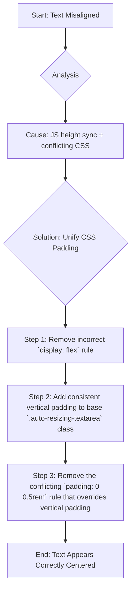

# Comprehensive Plan to Fix Textarea Vertical Alignment

## 1. Analysis of the Root Cause

My previous attempts failed because I did not correctly identify the multiple interacting factors causing the alignment problem. A deeper analysis reveals two primary causes:

1.  **JavaScript-driven Height Synchronization:** The `syncPairs` function within the `useLayoutEffect` hook correctly ensures that paired textareas (like "Contributing Cause" and "Potential Assumption") share the same height. However, when the height of a textarea with less text is increased to match its pair, the text content remains anchored to the top by default. This is the origin of the vertical misalignment.

2.  **Conflicting and Incorrect CSS Rules:** My attempts to fix this with padding were undermined by conflicting CSS rules and one incorrect rule.
    *   **Incorrect Rule:** The `display: flex; align-items: center;` I added to `.auto-resizing-textarea` was incorrect, as `textarea` elements do not align their internal text with flexbox properties.
    *   **Conflicting Rule:** The rule `.my-contributions-section .auto-resizing-textarea { padding: 0 0.5rem; }` was created to solve a width-consistency issue. However, it explicitly sets `padding-top` and `padding-bottom` to `0`, which completely nullified my attempt to add vertical padding for the "My Contributions" textboxes.

This combination of dynamic height adjustment and conflicting CSS is the true root cause of the issue.

## 2. Proposed Solution

The correct and robust solution is to apply consistent vertical padding to all relevant textareas while removing the conflicting CSS rules. This will create the necessary space above and below the text, making it appear vertically centered, which is the standard and appropriate UI solution for this problem.

Here is a Mermaid diagram outlining the plan:

## 3. Implementation Steps

I will execute the following precise changes in `frontend/src/app/SessionWizard.tsx`:

1.  **Revert Incorrect Styles:** I will remove the entire `.auto-resizing-textarea` rule that contains the incorrect `display: flex`.
2.  **Establish Correct Padding:** I will then re-introduce the `.auto-resizing-textarea` rule with the correct padding properties to provide consistent vertical and horizontal spacing.
3.  **Remove Conflicting Rule:** I will completely remove the `.my-contributions-section .auto-resizing-textarea` rule, as the horizontal padding it was meant to apply is now handled by a wrapper `div` and its vertical padding was causing the conflict.

This will result in a clean, non-conflicting set of styles that correctly aligns the text.

---

Please review this plan. I will not proceed until you confirm that you are satisfied with this analysis and approach.