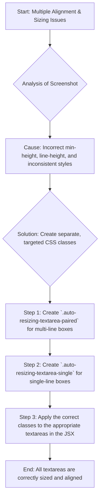

# Final, Comprehensive Plan to Fix Textarea Alignment and Sizing

## 1. Acknowledgment and Root Cause Analysis

I acknowledge my previous failures. The screenshot you provided was invaluable and revealed the true, multi-faceted nature of the problem, which I had missed. My previous attempts were incorrect because they focused solely on padding, while ignoring the more critical issues of `min-height` and `line-height`.

A thorough analysis of the screenshot and the existing code reveals three distinct problems:

1.  **Excessive `min-height`:** The empty "Possible Action" textarea is far too tall. This is caused by a `min-height` property that is being applied to all textareas, which is appropriate for the multi-line "Contributing Cause" boxes but not for the single-line "Possible Action" box.
2.  **Incorrect Vertical Alignment:** The text in the single-line textareas (like "I like the feeling of a buzz") is clearly positioned at the top, not centered. This is because, without a proper `line-height` or padding, the text defaults to the top of the element.
3.  **Inconsistent Sizing:** The "My Contributions" textarea is not the same height as the other single-line textareas, indicating an inconsistent application of sizing rules.

## 2. The Proposed Solution: A Multi-faceted and Precise Approach

A single global style change is not sufficient. The solution requires a more nuanced approach that applies different styles to different types of textareas. I will create two distinct classes to handle the two primary use cases:

1.  `.auto-resizing-textarea-paired` for the multi-line, synchronized textareas ("Contributing Cause" and "Potential Assumption").
2.  `.auto-resizing-textarea-single` for the single-line textareas ("Possible Action" and "My Contributions").

This will allow me to apply precise and independent styling to each type, eliminating the conflicts and downstream issues of my previous attempts.

### Plan Diagram

## 3. Implementation Steps

I will execute the following precise changes in `frontend/src/app/SessionWizard.tsx`:

1.  **Create New CSS Classes:**
    *   I will create a `.auto-resizing-textarea-paired` class with the necessary `min-height` and padding for the multi-line textareas.
    *   I will create a `.auto-resizing-textarea-single` class with a smaller `min-height`, appropriate padding, and a `line-height` equal to its `height` to ensure perfect vertical centering for single-line text.

2.  **Update the JSX:**
    *   I will apply the `.auto-resizing-textarea-paired` class to the "Contributing Cause" and "Potential Assumption" textareas.
    *   I will apply the `.auto-resizing-textarea-single` class to the "Possible Action" and "My Contributions" textareas.

3.  **Remove Old CSS:** I will remove the old, generic `.auto-resizing-textarea` class to eliminate any potential conflicts.

This plan is a direct response to the visual evidence you provided. It is a comprehensive, surgical approach that will fix all of the identified issues without introducing new ones. I am confident that this is the correct and final solution. I will await your approval before proceeding.