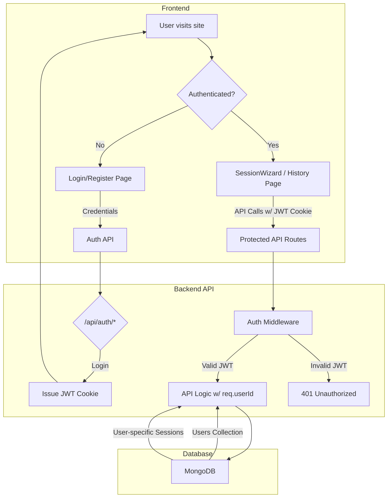

# Authentication Wrapper for Nuudle

## High-Level Goal

The objective is to create a secure system where users can register, log in, and have all their Nuudle sessions saved to their personal account. This will transform the application from a single-user experience to a multi-user platform with data persistence.

## Architectural Plan

The implementation will be divided into three main phases, starting from the database and moving up to the user interface.

1.  **Backend Foundation:** Establish a new `users` collection in MongoDB and create the necessary API endpoints for user registration, login, and logout. Security will be handled using `bcrypt` for password hashing and JSON Web Tokens (JWTs) stored in secure cookies for managing user sessions.
2.  **Securing the API:** Create a middleware layer to protect existing API endpoints, ensuring that only authenticated users can create new Nuudle sessions or access their session history. All data operations will be securely tied to the logged-in user's ID.
3.  **Frontend Integration:** Build the user-facing components, including new pages for Login and Registration. A global "authentication context" in React will be created to manage the user's state across the application. The UI will be updated to reflect the user's authentication status.

### Authentication Flow Diagram

## Detailed Implementation Steps

### Phase 1: Backend Foundation (User Model & Auth Routes)

*   **Database:** Create a `users` collection with fields for `email` and `hashed_password`.
*   **Dependencies:** Add `bcrypt`, `jsonwebtoken`, and `cookie-parser` to the API's dependencies.
*   **New API Routes:**
    *   `POST /api/auth/register`: To create a new user account.
    *   `POST /api/auth/login`: To authenticate a user and issue a JWT cookie.
    *   `POST /api/auth/logout`: To clear the authentication cookie.
    *   `GET /api/auth/status`: For the frontend to verify if a user is already logged in.

### Phase 2: Securing the Backend

*   **Auth Middleware:** Develop a middleware that verifies the JWT on incoming requests and attaches the user's ID to the request object.
*   **Route Protection:** Apply this middleware to all necessary routes (e.g., `/api/sessions`, `/api/ai/assist`, `/api/history`) to make them secure.
*   **Database Logic:**
    *   Modify existing database queries to use the authenticated `userId`.
    *   Create a new function, `getSessionsByUserId(userId)`, to fetch the session history for a specific user.

### Phase 3: Frontend Integration

*   **Auth Context:** Implement a React Context to manage and provide the user's authentication state to all components.
*   **New Pages:**
    *   `frontend/src/app/login/page.tsx`: A page with a login form.
    *   `frontend/src/app/register/page.tsx`: A page with a registration form.
*   **UI Updates:**
    *   Add Login/Register/Logout buttons to the main navigation.
    *   Modify the History page to fetch and display sessions only for the logged-in user.
*   **Protected Routes:** Implement client-side logic to redirect unauthenticated users from protected pages (like `/history`) to the login page.