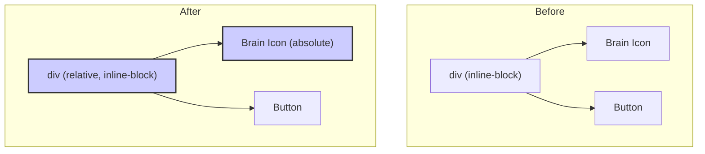

# Plan: Reposition the Brain Icon

The goal is to shift the brain icon slightly to the right and down so it overlaps more with the top-left corner of the "Help Me Nuudle" button. This will be achieved by modifying the styling of the icon and its container in `frontend/src/components/AIComponents.tsx`.

## Analysis

The `HelpMeNuudleButton` component currently renders the `Brain` icon and the `button` side-by-side. To create the overlap effect, their positioning needs to be changed.

### Diagram of Change

## Implementation Steps

1.  **Set Positioning Context:** Add the `relative` class to the container `div` inside the `HelpMeNuudleButton` component. This will allow positioning of child elements relative to this container.
2.  **Position the Icon:** Add the `absolute` class to the `Brain` icon and use Tailwind CSS utility classes (`top-1`, `left-1`) to shift it down and to the right. Add a `z-10` class to ensure it sits on top of the button.
3.  **Adjust Icon Size:** Slightly increase the icon's size for better visual balance in its new position.

This will result in the following changes in `frontend/src/components/AIComponents.tsx`:

*   The `div` on line 41 will be changed from `className="help-me-nuudle-button-container inline-block"` to `className="help-me-nuudle-button-container relative inline-block"`.
*   The `Brain` component on line 42 will be changed from `className="brain-icon w-4 h-4 text-blue-600"` to `className="brain-icon absolute top-1 left-1 w-5 h-5 text-blue-600 z-10"`.