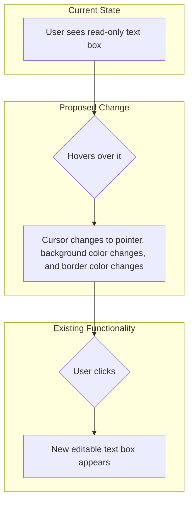

# Plan to Enhance Clickable Text Boxes

The goal is to make the read-only text boxes more clearly interactive by adding cursor, hover, and border effects. This will provide a clear visual cue to users that these elements are clickable.

## User Interaction Flow



## Implementation Details

New CSS rules will be added to `frontend/src/app/globals.css` to target the clickable containers. Specifically, the `.selectable-box` class will be modified.

### CSS Changes

1.  **Cursor Change**: The cursor will change to a pointer on hover.
2.  **Hover Effect**: A subtle background color will appear on hover.
3.  **Border Change**: The border color will change on hover to a more prominent color.
4.  **Smooth Transition**: The background and border color changes will be animated for a smoother user experience.

### CSS Rules

```css
.selectable-box {
  border: 1px solid #ccc;
  padding: 10px;
  margin: 5px;
  cursor: pointer;
  border-radius: 12px;
  word-wrap: break-word;
  transition: background-color 0.2s ease-in-out, border-color 0.2s ease-in-out;
}

.selectable-box:hover {
  background-color: #f0f0f0;
  border-color: #007bff;
}

.selectable-box.selected {
  border-color: #007bff;
}

@media (prefers-color-scheme: dark) {
  .selectable-box {
    border-color: #555;
  }
  .selectable-box:hover {
    background-color: #2a2a2a;
    border-color: #3B82F6;
  }
}