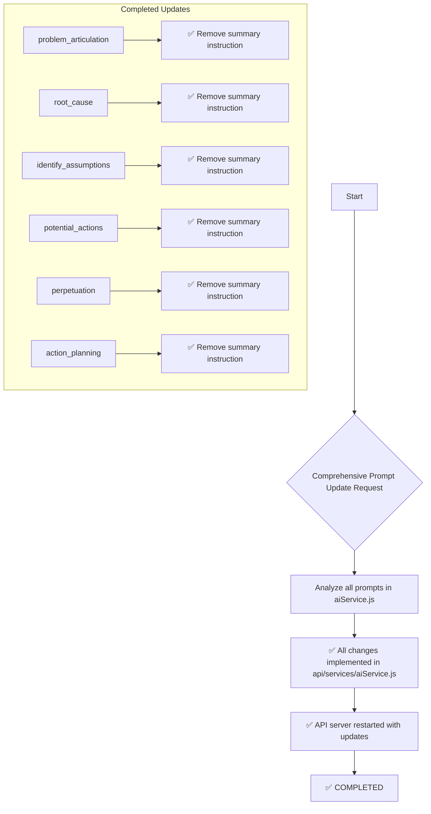

# Comprehensive AI Prompt Update Plan

## Objective

To improve the user experience across all AI prompts by removing redundant introductory summary sentences while maintaining the AI's ability to analyze user input. The goal is to make all prompts more direct and less verbose.

## Analysis

The relevant logic is in `api/services/aiService.js`, specifically within all prompt configurations that contained summary instructions.

## Completed Changes

### 1. Problem Articulation Prompts
- **`problem_articulation_direct`**: Removed "Begin your response by briefly acknowledging their problem in your own words (summarize, don't quote)"
- **`problem_articulation_intervention`**: Removed "then briefly acknowledge their problem in your own words (summarize, don't quote)"

### 2. Root Cause Analysis
- **`root_cause.body.analysis`**: Removed "Begin your response with a single sentence that summarizes your main cause."

### 3. Assumptions Analysis
- **`identify_assumptions.body.analysis`**: Removed "Begin your response with a single sentence that summarizes your main assumption."
- **`identify_assumptions_discovery.body.analysis`**: Previously updated to remove summary and change "analysis" to "what you've shared"

### 4. Potential Actions Analysis
- **`potential_actions.body.analysis`**: Removed "Begin your response with a single sentence that summarizes your problem and main action."

### 5. Perpetuation Analysis
- **`perpetuation.body.analysis`**: Removed "Begin your response with a single sentence that summarizes your problem."

### 6. Action Planning
- **`action_planning.body.analysis`**: Removed "Begin your response with a single sentence that summarizes your main concern and plan."

## Implementation Status

✅ **COMPLETED** - All prompt updates have been successfully implemented in `api/services/aiService.js`

## Key Principles Applied

1. **Remove User-Facing Summaries**: Eliminated instructions for the AI to summarize user input back to them
2. **Maintain Analysis Context**: Preserved all instructions for the AI to analyze and use the user's prior input
3. **Direct Engagement**: Prompts now go straight to the analysis and questions without redundant introductions
4. **Collaborative Language**: Where applicable, used "what you've shared" instead of "your analysis"

## Plan Diagram

## Results

All AI prompts in the Nuudle application now provide a more streamlined user experience by:
- Eliminating redundant summaries of user input
- Going directly to helpful analysis and questions
- Maintaining the AI's ability to understand and work with all user context
- Using more collaborative and personable language where appropriate

The API server has automatically restarted and all changes are now live in the application.