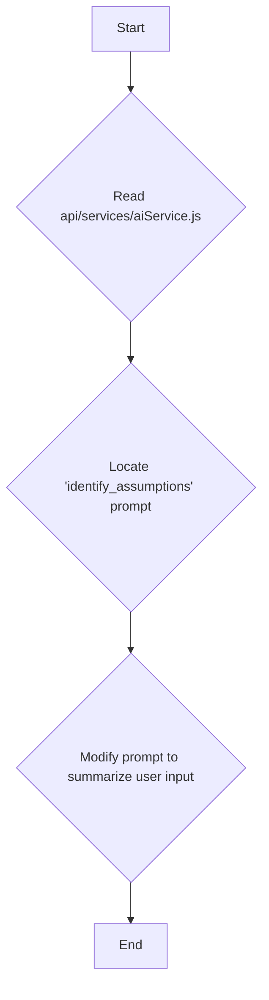
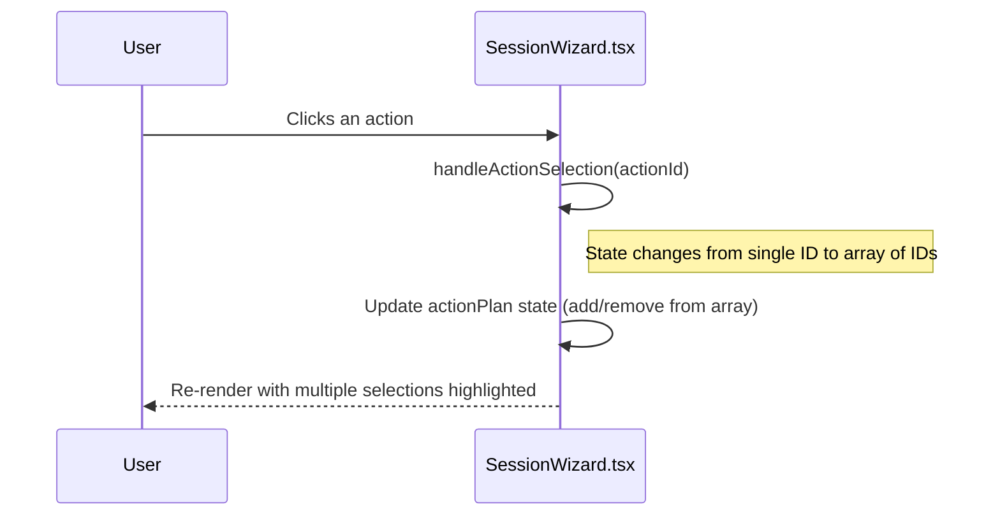

# Comprehensive Update Plan

This document outlines the plan to address three key issues in the Nuudle application: AI prompt summarization, multi-select functionality, and UI misalignment.

### 1. AI Prompt Summarization

The "Help me identify assumptions" AI response currently repeats user input verbatim. This will be corrected to summarize the input, providing a more helpful and concise response.

*   **File to Modify:** `api/services/aiService.js`
*   **Change:** The `analysis` section of the `identify_assumptions` prompt will be updated to instruct the AI to summarize the user's input, similar to the `action_planning` prompt.



### 2. Enable Multi-select for Actions

The "Stop Nuudling. Start Doodling." step will be updated to allow users to select multiple actions, providing more flexibility in their action planning.

*   **File to Modify:** `frontend/src/app/SessionWizard.tsx`
*   **Changes:**
    1.  The `actionPlan` state will be modified to hold an array of selected action IDs.
    2.  The `handleActionSelection` function will be updated to manage the array of selections.
    3.  The JSX will be adjusted to correctly render multiple selected actions.
    4.  The `handleSubmit` function will be updated to process the array of selected actions.



### 3. Fix UI Misalignment of 'x' Button

The 'x' button for removing items is misaligned in two steps due to a two-column layout. The CSS will be adjusted to ensure proper alignment, consistent with other parts of the UI.

*   **Files to Modify:** `frontend/src/app/globals.css` and `frontend/src/app/SessionWizard.tsx`
*   **Changes:**
    *   **"Why do you think this problem is happening?" step:** The delete button will be moved inside the `cause-column` in `SessionWizard.tsx` for correct positioning.
    *   **"What can you do about it?" step:** The `action-textarea-container` will be set to `position: relative`, and the button's position will be adjusted as needed to match the "What worries you?" step.

```mermaid
graph TD
    F[Start] --> G{Analyze CSS for .delete-item-button};
    G --> H{"Why do you think this problem is happening?"};
    H --> I{Move button inside cause-column in SessionWizard.tsx};
    G --> J{"What can you do about it?"};
    J --> K{Ensure parent container has 'position: relative'};
    I --> L[End];
    K --> L[End];