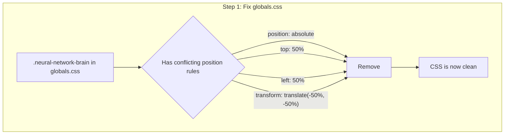
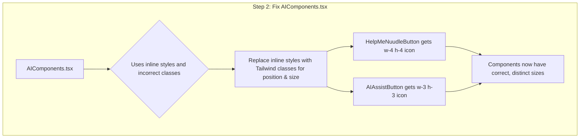

# Final Fix Plan: Resolving CSS Conflicts

This document outlines the definitive plan to fix the AI button brain icon sizing issue by resolving CSS conflicts and aligning the implementation with the approved design.

### Analysis of the Problem

A thorough review of `final_overlay_plan.md` and `frontend/src/components/AIComponents.tsx` revealed the following issues:

1.  **Conflicting CSS Rules:** The file `frontend/src/app/globals.css` contains a class named `.neural-network-brain` which has CSS rules that force the icon to be centered within its container (`top: 50%`, `left: 50%`, `transform: translate(-50%, -50%)`).
2.  **Override Precedence:** These global CSS rules are overriding the positioning and sizing being applied at the component level.
3.  **Plan Deviation:** The current implementation uses inline styles, which deviates from the cleaner, class-based approach specified in `final_overlay_plan.md`.

### The Correct Plan to Fix the Issue

To permanently fix this, a two-step plan will be executed.

**Step 1: Modify Global CSS to Remove Conflicts**

The conflicting positioning rules will be removed from the `.neural-network-brain` class in `frontend/src/app/globals.css`. This class should only be responsible for the visual effect (`filter`) and stacking (`z-index`), not its position.

**Step 2: Update Components to Use Correct Utility Classes**

With the global conflict resolved, `frontend/src/components/AIComponents.tsx` will be modified to precisely match the structure from the approved plan, using only Tailwind utility classes for layout and sizing.

*   **`HelpMeNuudleButton`:** The brain icon will have `w-4 h-4` (16px) for the larger size.
*   **`AIAssistButton`:** The brain icon will have `w-3 h-3` (12px) for the smaller size.

This plan directly addresses the root cause and will resolve the issue.