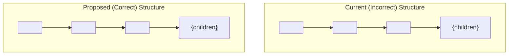

# Plan to Fix Next.js Hydration Error

## 1. Diagnosis

A hydration error is occurring because the server-rendered HTML for the `<html>` tag does not match the client-side rendered HTML. This is caused by the `next-themes` `ThemeProvider` modifying the `<html>` tag after the initial server render.

*   **Server HTML:** `<html lang="en">`
*   **Client HTML:** `<html lang="en" data-theme="dark" style="color-scheme: dark">`

The `ThemeProvider` is currently placed inside the `<body>` in `frontend/src/app/layout.tsx`, preventing it from modifying the `<html>` tag during server-side rendering.

## 2. The Fix

The solution involves two key changes in `frontend/src/app/layout.tsx`:

1.  **Restructure the Layout**: Move the `<ThemeProvider>` to wrap the `<body>` element. This allows the provider to control the theme attributes on the `<html>` tag correctly.
2.  **Suppress Hydration Warning**: Add the `suppressHydrationWarning` prop to the `<html>` tag. This is a necessary escape hatch in React to tell it to ignore the expected and unavoidable mismatch of the `data-theme` attribute between the server and client.

### Component Structure Change

This diagram illustrates the required structural change:

## 3. Implementation Steps

1.  Modify `frontend/src/app/layout.tsx`.
2.  Apply the structural changes as described above.
3.  The application should then run without the hydration error.