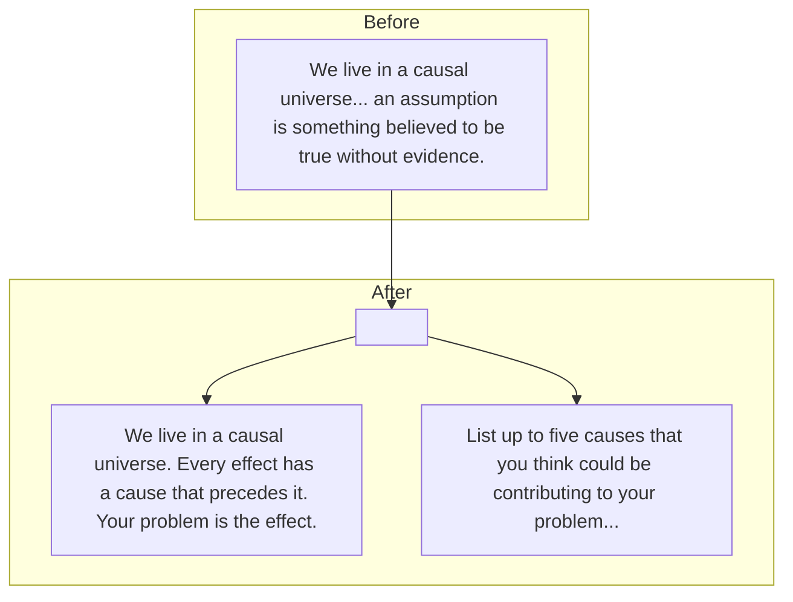

### Plan to Update the UI Text

1.  **Modify Step 1 Text:** I will separate the introductory text in Step 1 into two distinct paragraphs to improve readability.
2.  **Capitalize Labels:** I will capitalize the words "Cause" and "Assumption" in the input field labels for both Step 1 and Step 3 to ensure consistency.

Here is a diagram illustrating the change to the text block:

All changes will be applied to the `frontend/src/app/page.tsx` file.