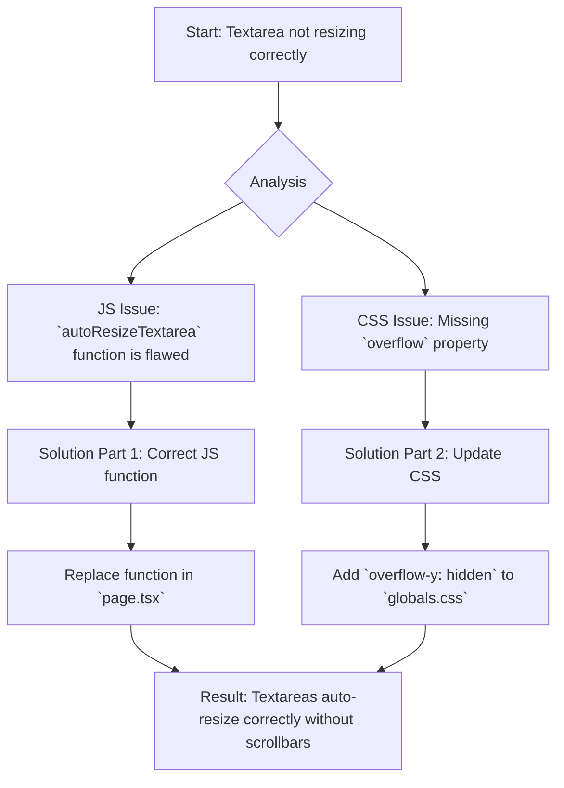

# Plan to Fix Auto-Resizing Textareas

**1. The Problem**

The textareas are not resizing as expected. Instead of growing vertically to accommodate more text, they show a scrollbar. They also fail to shrink when text is deleted. The desired behavior is for them to dynamically resize with the content, without ever showing a scrollbar.

**2. Analysis**

After reviewing the code, I've identified two root causes:

*   **JavaScript (`page.tsx`):** The `autoResizeTextarea` function in `frontend/src/app/page.tsx` contains logic that incorrectly prevents the textarea from shrinking after text has been deleted.
*   **CSS (`globals.css`):** The CSS for `.auto-resizing-textarea` in `frontend/src/app/globals.css` is missing an `overflow-y: hidden;` property. This allows the scrollbar to appear when the content's height temporarily mismatches the element's height during resizing.

**3. Proposed Solution**

I will implement a two-part fix that is a standard and robust pattern for this functionality.



**Part 1: Correct the JavaScript Logic**

I will replace the current `autoResizeTextarea` function with a simpler, more effective version that allows the textarea to both expand and contract.

*   **File:** `frontend/src/app/page.tsx`
*   **Action:** Replace the function at lines 299-305.

**New `autoResizeTextarea` function:**
```typescript
  const autoResizeTextarea = (element: HTMLTextAreaElement) => {
    element.style.height = "auto";
    element.style.height = `${element.scrollHeight}px`;
  };
```

**Part 2: Update the CSS Styling**

To support the JavaScript change and ensure a scrollbar never appears, I will add a single line to the CSS rules for the textareas.

*   **File:** `frontend/src/app/globals.css`
*   **Action:** Add `overflow-y: hidden;` to the `.auto-resizing-textarea` class definition.

**CSS Modification:**
```css
.auto-resizing-textarea,
input[type="text"] {
  width: 100%;
  min-height: 75px;
  padding: 12px;
  flex: 1;
  border: 1px solid #ccc;
  border-radius: 5px;
  resize: none;
  font-family: inherit;
  font-size: 16px;
  line-height: 1.5;
  text-align: center;
  overflow-y: hidden; /* This line will be added */
}
```

This combined approach will resolve the resizing issues and provide the seamless user experience you're looking for.