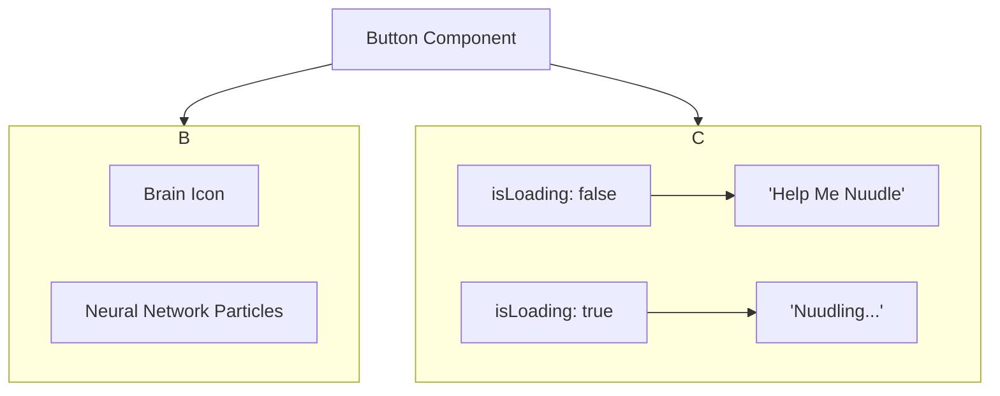

### Revised Plan to Restore Animated Brain Icon

**Goal:** The AI buttons (`HelpMeNuudleButton` and `AIAssistButton`) should *always* display the animated, overlaid brain icon. The icon's visibility will not be affected by the button's loading state. The only change during the "Nuudling..." state will be the button's text.

**Mermaid Diagram of Final Button State:**

**Execution Steps:**

1.  **Edit `frontend/src/components/AIComponents.tsx`:**
    *   **`HelpMeNuudleButton` & `AIAssistButton`:** I will add the JSX for the animated brain icon back into both button components. This consists of the `Brain` icon itself, wrapped in a container with the `neural-network-brain` class that includes the animated particles. This entire element will be rendered unconditionally within the buttons.
    *   I will ensure the `isLoading` prop only toggles the button text (e.g., from "Help Me Nuudle" to "Nuudling...") and does not affect the icon's visibility.

This will restore the desired visual effect, keeping the animation consistent across all button states while removing the incorrect, non-animated icon from the loading state.