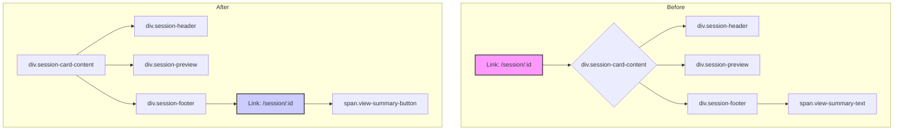

# Session History Click Behavior Update Plan

## 1. Project Goal

The goal of this project is to modify the session history page so that only the "Click to view AI-powered summary" text navigates to the session summary page. Currently, the entire session card is clickable. Additionally, the clickable text should be styled to look more like a button to improve user experience.

## 2. Proposed Changes

### 2.1. Modify `SessionCard.tsx`

-   **Remove Wrapping Link:** The `<Link>` component that currently wraps the main content of the session card will be removed.
-   **Add Scoped Link:** A new `<Link>` component will be added to wrap only the "Click to view AI-powered summary" text. This link will navigate to the appropriate session summary page.
-   **Add New CSS Class:** A new CSS class, `view-summary-button`, will be added to the new link to allow for specific styling.

### 2.2. Update Styles

-   **Add Button Styles:** New styles will be added to `frontend/src/app/globals.css` for the `.view-summary-button` class. These styles will make the link look like a button, providing a clear visual cue to the user that it is clickable.

## 3. Mermaid Diagram: Component Change

This diagram illustrates the proposed change in the component structure.

## 4. Implementation Steps

1.  **Modify `frontend/src/components/SessionCard.tsx`:** Apply the changes described in section 2.1.
2.  **Modify `frontend/src/app/globals.css`:** Add the new styles as described in section 2.2.
3.  **Test:** Verify that only the button is clickable and that it navigates to the correct session summary page.
