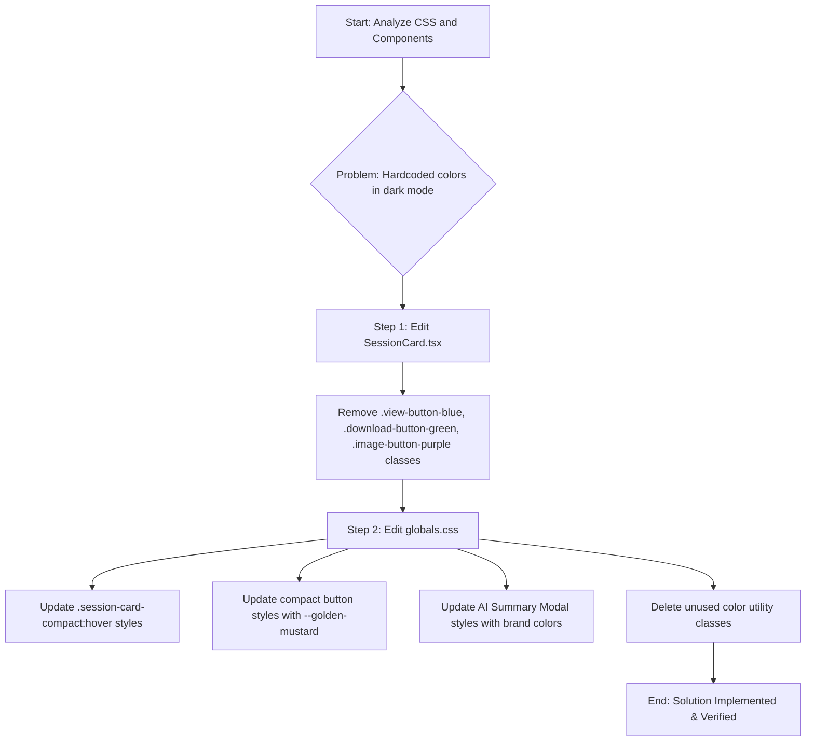

### Plan to Update Session Summary Colors

The core of the problem lies in `globals.css`, where dark mode styles for session components are using hardcoded color values, and in `SessionCard.tsx`, which applies specific classes that use these incorrect colors.

My plan is to remove the hardcoded styles and replace them with the correct CSS variables for your new brand colors.

**Step 1: Remove Hardcoded Color Classes from `SessionCard.tsx`**

I will start by editing `frontend/src/components/SessionCard.tsx`. I will remove the classes that apply the incorrect blue, green, and purple colors (`view-button-blue`, `download-button-green`, `image-button-purple`) from the buttons. This will allow them to inherit the correct theme-based styling we will define in the next step.

**Step 2: Update Dark Mode Styles in `globals.css`**

Next, I will modify `frontend/src/app/globals.css` to replace the incorrect hardcoded colors with the new brand color variables.

I will make the following changes:

1.  **Update `session-card-compact` styles:** I will change the `border-color` on hover to use `--golden-mustard`.
2.  **Update button styles:** I will update the `background-color` and `border-color` for the following classes in dark mode to use `--golden-mustard` and its variants:
    *   `.view-summary-button-compact`
    *   `.download-button-compact`
    *   `.image-button-compact`
3.  **Update AI Summary Modal styles:** I will update the colors in the AI summary modal to use the new brand colors. This includes:
    *   The border on `.insights-list li`.
    *   The border on `.primary-action`.
    *   The background of `.conclusion-section`.
4.  **Remove Unused Classes:** I will remove the now-unused classes `.view-button-blue`, `.download-button-green`, and `.image-button-purple` to clean up the CSS.

This plan will ensure that the Session Summary components are correctly styled for dark mode, adhering to your brand guidelines.