# Plan to Improve UI Consistency

The goal is to address styling inconsistencies in the "What can you do about it?" step of the session wizard. The alignment and spacing will be improved to make the layout more consistent and visually appealing.

### 1. Analyze Current Styling
I will begin by re-examining `frontend/src/app/SessionWizard.tsx` to identify the specific containers and CSS classes that control the layout of the "Contributing Cause," "Potential Assumption," and "My Contributions" sections.

### 2. Proposed Changes
*   **Standardize Width**: I will adjust the styling of the "My Contributions" text box to ensure it has the same width as the "Possible Action" text box. This will likely involve applying consistent padding or container styles.
*   **Uniform Spacing**: I will standardize the vertical spacing between the labels and their corresponding text boxes. I'll use the spacing of the "My Contributions" section as the template, as you indicated it is correct.
*   **Increase Section Spacing**: I will add more vertical space between the main "Contributing Cause" / "Potential Assumption" container and the "My Contributions" section to prevent them from appearing cramped.

### Diagram of the New Layout

```mermaid
graph TD
    subgraph "Current Layout"
        A[Contributing Cause / Potential Assumption] --> B(Possible Action Box);
        B --> C(My Contributions);
        C --> D(Possible Action Box for Contributions);
    end

    subgraph "Proposed Layout"
        E[Contributing Cause / Potential Assumption] -- "Increased Margin" --> F(Possible Action Box - Consistent Width);
        F -- "Standardized Spacing" --> G(My Contributions Label);
        G -- "Standardized Spacing" --> H(My Contributions Box - Consistent Width);
        H -- "Standardized Spacing" --> I(Possible Action Label);
        I -- "Standardized Spacing" --> J(Possible Action Box for Contributions - Consistent Width);
    end
```

This plan will create a more organized and visually balanced layout for this step.