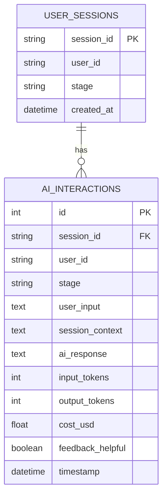
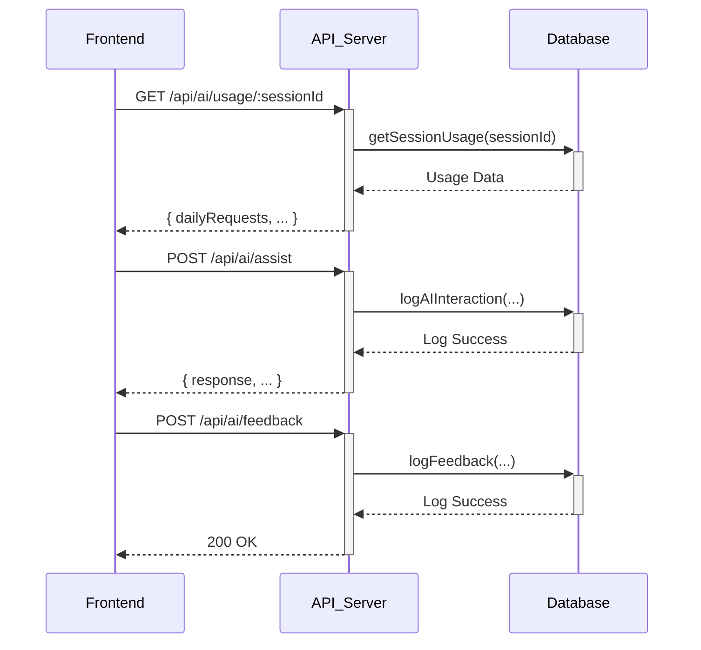

# Plan: AI Integration Testing and Implementation

This plan outlines the steps to manually test the existing AI integration, implement the missing backend endpoints, and establish a foundational unit testing suite. This will be done in three phases, incorporating the strategies from the provided testing document.

## Phase 1: Manual Testing & Verification

This phase focuses on understanding the current state of the AI integration by manually testing the user-facing features.

**Goal:** Verify the functionality of the AI toggle and assist buttons, and confirm the `/api/ai/assist` endpoint is reachable.

**Steps:**
1.  **Launch the Application:** Ensure the `frontend` and `api` servers are running.
2.  **Test AI Toggle:**
    *   Navigate to the main page.
    *   Click the "AI Coach" toggle.
    *   **Expected Outcome:** The toggle should switch to an "Active" state. The UI should reflect this change.
3.  **Test AI Assist Button (Problem Articulation):**
    *   Enter text into the "What problem would you like to work through?" text area.
    *   Click the "Get clarifying questions" button.
    *   **Expected Outcome:**
        *   The button should enter a "loading" state ("AI is thinking...").
        *   After a short delay, an `AIResponseCard` should appear with the mocked response: "What is the underlying assumption you're making about this problem?".
        *   The usage counter in the `AIToggle` component should update.
4.  **Test API Endpoint Directly:**
    *   Use a tool like `curl` or Postman to send a POST request to `http://localhost:3001/api/ai/assist`.
    *   **Request Body:**
        ```json
        {
          "stage": "problem_articulation",
          "context": { "painPoint": "Test from curl" }
        }
        ```
    *   **Expected Outcome:** A 200 OK response with the JSON body: `{"question":"What is the underlying assumption you're making about this problem?"}`.
5.  **Verify Database Logging:**
    *   Check the `usage.db` file to confirm that the API call was logged in the `api_usage` table.

## Phase 2: Backend Endpoint Implementation

This phase will add the two missing endpoints to the `api` server and update the database schema to support more detailed tracking.

**Goal:** Implement `GET /api/ai/usage/:sessionId` and `POST /api/ai/feedback`.

### 2.1. Database Schema Update

First, I'll update the database schema to align with the requirements for tracking usage and feedback.

**Mermaid Diagram: New Database Schema**


**Plan:**
1.  Modify `api/services/databaseService.js` to create the `USER_SESSIONS` and `AI_INTERACTIONS` tables on initialization.
2.  Add new functions to `databaseService.js`:
    *   `createSession(sessionId, userId)`
    *   `logAIInteraction(interactionData)`
    *   `logFeedback(sessionId, interactionId, helpful)`
    *   `getSessionUsage(sessionId)`
    *   `getDailyUsage(userId)`

### 2.2. Endpoint Implementation

**Plan:**
1.  **`GET /api/ai/usage/:sessionId`**
    *   In `api/server.js`, add a new route handler for this endpoint.
    *   The handler will call `getSessionUsage(sessionId)` from the `databaseService`.
    *   It will return the usage data in the format expected by the frontend: `{ dailyRequests, dailyLimit, sessionRequests, sessionLimit }`.
2.  **`POST /api/ai/feedback`**
    *   In `api/server.js`, add a new route handler.
    *   The handler will receive `{ sessionId, helpful, response }` in the request body.
    *   It will call a new function `logFeedback` in the `databaseService` to store the feedback.
    *   It will return a 200 OK status on success.

**Mermaid Diagram: API Flow**


## Phase 3: Unit Testing Setup

This phase establishes the testing foundation described in the provided document.

**Goal:** Set up Jest and Supertest, and create initial unit tests for the backend.

**Plan:**
1.  **Install Dependencies:**
    *   Add `jest`, `supertest`, and `cross-env` to the `devDependencies` in `api/package.json`.
2.  **Configure Jest:**
    *   Create a `jest.config.js` file in the `api` directory.
3.  **Add Test Scripts:**
    *   Update the `scripts` section of `api/package.json` to include a `test` script: `"test": "cross-env NODE_ENV=test jest"`.
4.  **Create Initial Unit Tests:**
    *   Create a `__tests__` directory inside `api/`.
    *   **Database Service Tests (`api/__tests__/databaseService.test.js`):**
        *   Write tests for `createSession`, `logAIInteraction`, and `getSessionUsage` using an in-memory SQLite database for isolation.
    *   **API Integration Tests (`api/__tests__/ai.integration.test.js`):**
        *   Use `supertest` to write tests for the three API endpoints:
            *   `POST /api/ai/assist`: Test for successful response, input validation, and rate limiting.
            *   `GET /api/ai/usage/:sessionId`: Test for correct usage data retrieval.
            *   `POST /api/ai/feedback`: Test for successful feedback submission.