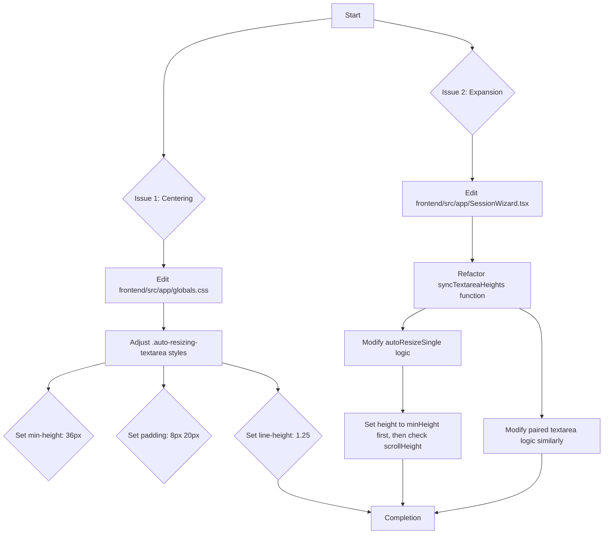

### Plan to Fix Textbox Issues

Here is the plan to address the two issues with the text boxes:

1.  **Placeholder Text Centering (Issue 1)**
2.  **Premature Expansion (Issue 2)**

---

### Mermaid Diagram of Changes



---

### Step 1: Fix Placeholder Text Centering in CSS

To fix the vertical alignment of the placeholder text, I will adjust the CSS for the `.auto-resizing-textarea` class in `frontend/src/app/globals.css`. The current combination of `min-height`, `padding`, and `line-height` causes the text to be misaligned.

**File to modify:** `frontend/src/app/globals.css`

**Changes:**

I will replace the existing style block for `.auto-resizing-textarea` and `input[type="text"]` with the following:

```css
.auto-resizing-textarea,
input[type="text"] {
  width: 100%;
  min-height: 36px;
  padding: 8px 20px;
  border: 1px solid #ccc;
  border-radius: 12px;
  resize: none;
  font-family: inherit;
  font-size: 16px;
  line-height: 1.25;
  text-align: center;
  overflow-y: hidden;
  box-sizing: border-box;
  overflow-wrap: break-word;
}
```

This change adjusts the `min-height` to `36px` to match the JavaScript logic, and modifies `padding` and `line-height` to ensure the text (and placeholder) is vertically centered within the box.

---

### Step 2: Fix Premature Textbox Expansion Logic

To prevent the textarea from expanding prematurely, I will refactor the `syncTextareaHeights` function in `frontend/src/app/SessionWizard.tsx`. The current logic is sensitive to CSS and browser behavior, causing it to expand even for a single line of text. The new logic will be more robust.

**File to modify:** `frontend/src/app/SessionWizard.tsx`

**Changes:**

I will replace the entire `syncTextareaHeights` function (lines 334-378) with the following implementation:

```typescript
  const syncTextareaHeights = (
    element1: HTMLTextAreaElement,
    element2?: HTMLTextAreaElement,
    index?: number
  ) => {
    if (!element1) return;

    const autoResizeSingle = (el: HTMLTextAreaElement) => {
      const minHeight = 36;
      el.style.height = `${minHeight}px`; // Set to min height first
      const scrollHeight = el.scrollHeight;
      if (scrollHeight > minHeight) {
        el.style.height = `${scrollHeight}px`;
      }
    };

    if (!element2) {
      autoResizeSingle(element1);
      return;
    }

    const minHeight = 36;
    element1.style.height = `${minHeight}px`;
    element2.style.height = `${minHeight}px`;
    
    const scrollHeight1 = element1.scrollHeight;
    const scrollHeight2 = element2.scrollHeight;

    const finalHeight = Math.max(scrollHeight1, scrollHeight2, minHeight);

    element1.style.height = `${finalHeight}px`;
    element2.style.height = `${finalHeight}px`;

    if (index !== undefined) {
      setCauseTextareaHeights(prev => ({ ...prev, [index]: finalHeight }));
    }
  };
```

This new implementation first resets the height of the textarea(s) to the minimum height, then checks the `scrollHeight`. The height is only increased if the content actually requires more space, preventing the premature expansion.