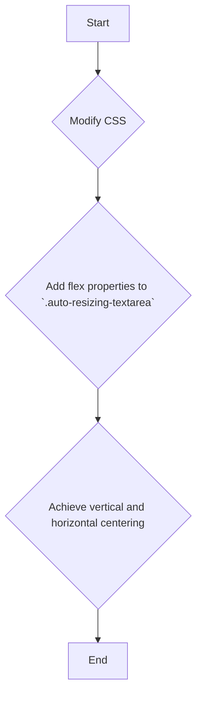

# Text Box Fixes Plan

This document outlines the plan to address two issues with text boxes in the Session Wizard: centering text and preserving text box size between steps.

## The Problem

1.  **Text Centering:** The text in the text boxes is horizontally centered but not vertically. This is because the CSS for `.auto-resizing-textarea` only includes `text-align: center;`.
2.  **Textbox Size in Step 3:** When you move from Step 1 to Step 3, the textareas in Step 3 are re-rendered. The `syncTextareaHeights` function is then called, which resizes the textareas based on their content. This causes them to expand if the text from Step 1 was long enough, instead of preserving the size they had in Step 1.

## The Plan

Here is the proposed plan to fix these issues:

### 1. Center Text Horizontally and Vertically

To center the text inside the textareas, I will make the following changes to `frontend/src/app/globals.css`:



I will modify the `.auto-resizing-textarea` class to use flexbox for alignment. This is a clean, CSS-only solution that will not interfere with the existing JavaScript logic.

### 2. Preserve Textbox Size from Step 1 to Step 3

To ensure the textbox dimensions from Step 1 are maintained in Step 3, I will implement the following logic in `frontend/src/app/SessionWizard.tsx`:

```mermaid
graph TD
    subgraph Step 1
        A[User types in textarea] --> B{Call `syncTextareaHeights`};
        B --> C{Store calculated height in a new state variable `causeTextareaHeights`};
    end
    subgraph Navigation
        D[User clicks "Next"] --> E{Navigate to Step 3};
    end
    subgraph Step 3
        F[Render read-only textareas] --> G{Apply stored height from `causeTextareaHeights` as inline style};
        G --> H{Remove `onInput` handler to prevent resizing};
    end
    C --> D;
    E --> F;
```

This involves:
*   Creating a new state variable, `causeTextareaHeights`, to store the height of each textarea pair in Step 1.
*   Updating `syncTextareaHeights` to populate this state variable as the user types.
*   Applying these stored heights as inline styles to the read-only textareas in Step 3.
*   Removing the `onInput` handler from the read-only textareas in Step 3 to prevent them from being resized.