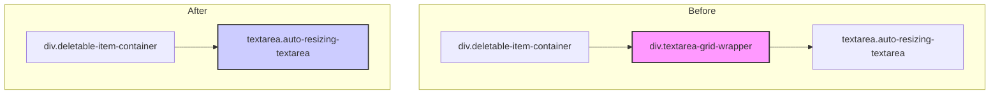

### Plan: Dynamic Font-Based Textarea Implementation

This plan outlines the steps to replace the current grid-based textarea resizing with a modern, dynamic, font-based approach. This will simplify the code, improve performance, and make the component more maintainable.

#### 1. Component Structure Change

The current JSX structure relies on a wrapper `div` to achieve resizing. We will simplify this by removing the wrapper.

#### 2. CSS Modifications (`frontend/src/app/globals.css`)

I will update the global stylesheet to remove the old grid-based styles and implement the new, cleaner CSS.

*   **Remove Obsolete Styles:**
    *   Delete the entire `.textarea-grid-wrapper` style block.
    *   Delete the `.textarea-grid-wrapper::after` pseudo-element styles.
*   **Implement New Textarea Styles:**
    *   Replace the existing `.auto-resizing-textarea` styles with the new "Pure CSS Calculation" styles you provided. This includes using CSS custom properties (`--base-height`, `--vertical-padding`) for dynamic sizing and `display: grid` with `place-items: center` for perfect centering.
    *   Add the `::placeholder` styles for centered placeholder text.

#### 3. React Component Logic (`frontend/src/app/SessionWizard.tsx`)

I will update the React component to simplify the logic for handling textarea height.

*   **Simplify `useLayoutEffect`:**
    *   The current `useLayoutEffect` is overly complex and tied to the old grid system. I will replace it with the new, streamlined version that directly adjusts the textarea's height based on its `scrollHeight`.
*   **Simplify `syncTextareaHeights` Function:**
    *   The current `syncTextareaHeights` function will be replaced with the simplified version that performs the same logic as the new `useLayoutEffect`, ensuring height is adjusted correctly on user input.
*   **Update JSX Structure:**
    *   I will go through the entire `SessionWizard.tsx` file and remove every instance of the `
` that wraps a `<textarea>`.
    *   This change will be applied to all textareas, including the initial pain point, causes, assumptions, perpetuations, solutions, fears, and the final action plan.

---

This plan will result in a much cleaner, more efficient, and more robust textarea component that behaves exactly as described.