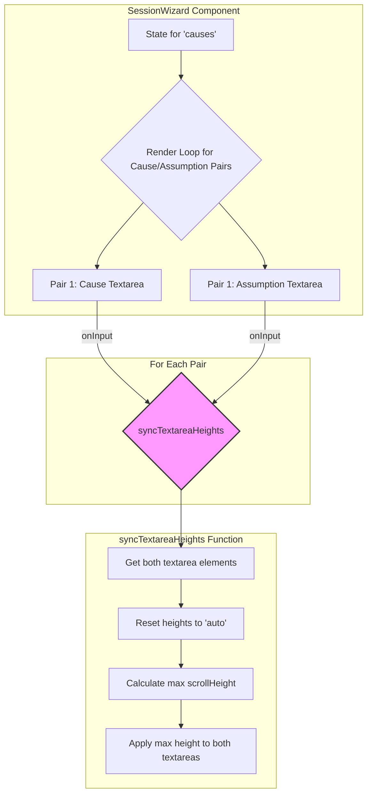

### Plan to Fix Textarea Height Synchronization

#### 1. Diagnosis of the Root Cause

The component currently uses a `useEffect` hook that attempts to resize all textareas with the class `auto-resizing-textarea` whenever there's a state change. This hook's logic for pairing textareas is flawed because it queries textareas from the entire document—including hidden steps—and incorrectly pairs them based on their order in the DOM. This global, faulty resizing logic interferes with the correct, pair-specific resizing that is supposed to happen on user input.

The `onInput` handlers for each textarea pair are correctly set up to call the `autoResizeTextarea` function with the right sibling, but their effect is being undone by the problematic `useEffect`.

#### 2. Proposed Solution

My plan is to remove the incorrect global resizing logic and replace it with a more targeted approach. I will create a dedicated function to manage the height synchronization for each pair of textareas. This will encapsulate the logic cleanly and ensure that resizing only affects the intended pairs.

Here is a Mermaid diagram illustrating the proposed logic:

#### 3. Step-by-Step Implementation Plan

1.  **Remove Problematic `useEffect`:** I will start by deleting the `useEffect` at `frontend/src/app/SessionWizard.tsx:71-83` to eliminate the source of the incorrect resizing behavior.

2.  **Refactor `autoResizeTextarea`:** I will rename the `autoResizeTextarea` function to `syncTextareaHeights` to more accurately reflect its purpose. The core logic will be slightly adjusted to ensure it robustly handles the two textareas passed to it.

3.  **Update `onInput` Handlers:** The `onInput` handlers for the "Contributing Cause" and "Potential Assumption" textareas will be updated to call the new `syncTextareaHeights` function, ensuring that the correct pair of textareas is resized together.

4.  **Add a `useEffect` for Dynamic Resizing:** I will introduce a new `useEffect` that triggers the `syncTextareaHeights` function whenever the `causes` array changes. This will handle the initial rendering and cases where rows are added or removed, ensuring all pairs are correctly sized.

This approach will result in a more robust, maintainable, and bug-free solution that correctly handles the height synchronization as per your requirements.