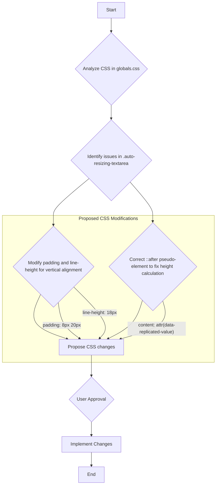

# Plan to Fix Textbox Sizing and Centering

The following plan outlines the steps to resolve the textbox height and text alignment issues in the application.

### 1. Adjust CSS for Correct Sizing and Centering

The primary issue lies in the CSS properties of the auto-resizing textareas. The following modifications will be made to `frontend/src/app/globals.css`:

*   **Modify `.auto-resizing-textarea` and its `::after` pseudo-element:**
    *   Change `padding` from `7px 20px` to `8px 20px`.
    *   Change `line-height` from `20px` to `18px`.
    *   Remove the trailing space from the `content` property of the `textarea-grid-wrapper::after` pseudo-element to prevent incorrect height calculations.

### Diagram of Proposed Changes

### Verification Steps

After implementation, the following will be verified:
1.  The computed height of the textbox is 36px using the browser inspector.
2.  Placeholder text and typed text are both vertically centered.
3.  Layout spacing issues are resolved.
4.  Auto-expansion of the textarea continues to work as expected when typing multiple lines.

### Backup Plan

If the initial adjustments do not resolve the issue, the following will be considered:
*   Set `line-height: 36px` to force the text to center within the full container height.
*   Further adjust the `padding` values.