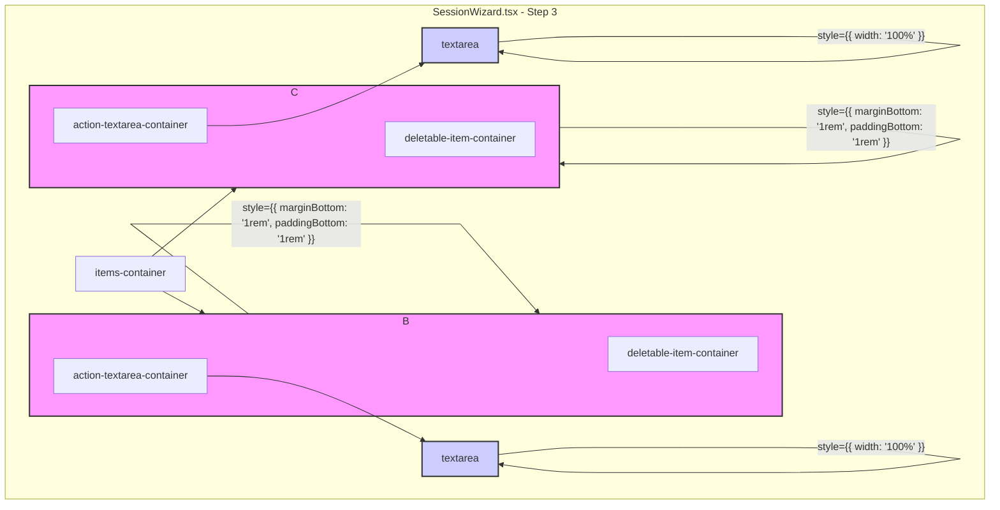

# UI Fixes for Step 3 in Session Wizard

**Introduction:**
This plan outlines the changes required to fix the UI issues in Step 3 of the Session Wizard, as requested. The goal is to improve design consistency by adjusting spacing and element widths.

**Problem:**
1.  The parent containers in Step 3 have inconsistent spacing, with no space at the bottom.
2.  The "Possible Action" text box is not aligned with the text boxes above it, and its width is not consistent.

**Proposed Solution:**
I will modify the `frontend/src/app/SessionWizard.tsx` file to apply inline styles that will correct the spacing and width issues.

**Detailed Plan:**

1.  **Adjust Container Spacing:**
    -   I will add `marginBottom: '1rem'` to the main `actionable-item-container` for each item in Step 3. This will create consistent vertical spacing between the items.
    -   I will also conditionally add `paddingBottom: '1rem'` to the same container, but only when the "Possible Action" text box is visible. This will add the required space inside the container at the bottom, matching the top spacing.

2.  **Adjust Textbox Width:**
    -   I will add `width: '100%'` to the inline styles of the `textarea` for the "Possible Action". This will make it span the full width of its container, aligning it with the elements above it.

**Mermaid Diagram:**
Here is a diagram illustrating the component structure and where the changes will be applied.

**Conclusion:**
These changes will address the UI inconsistencies in Step 3, resulting in a more polished and visually balanced design.