# Plan for UI Improvements

This document outlines the plan to implement several UI improvements across the entire AI integration.

## 1. Standardize AI Button Loading Text

-   **File to modify:** `frontend/src/components/AIComponents.tsx`
-   **Change:** In the `AIAssistButton` component, the loading text will be changed from "AI is thinking..." to "Nuudling..." to match the `HelpMeNuudleButton`.

## 2. Adjust Button Sizing and Visual Hierarchy

-   **Files to modify:** `frontend/src/components/AIComponents.tsx` and `frontend/src/app/globals.css`.
-   **Changes:**
    1.  **"Help Me Nuudle" Button:** The CSS for the "Begin" button will be inspected, and similar sizing classes will be applied to the `HelpMeNuudleButton` to ensure they are identical in size.
    2.  **Secondary AI Buttons:** The text size and padding for all AI buttons (`HelpMeNuudleButton` and `AIAssistButton`) will be reduced to make them appear as secondary, helpful actions. This will involve adjusting Tailwind CSS classes (e.g., from `text-base` to `text-sm`, and reducing `px` and `py` values).

## 3. Reposition AI Buttons

-   **File to modify:** `frontend/src/app/SessionWizard.tsx`
-   **Changes:** All AI-related buttons will be moved to be positioned directly underneath their relevant content sections and above the main action buttons (like "Back", "Next").
    -   **Step 0:** `HelpMeNuudleButton` will be moved to be under the main problem text area.
    -   **Step 1:** The "Help me discover..." and "Help me identify..." buttons will be moved to be under the "Contributing Cause" input boxes.
    -   **Step 2, 3, 4:** The same logic will be applied, repositioning the AI buttons in each step to follow their content areas.

### Example Component Structure Change (Step 1)

```mermaid
graph TD
    subgraph Step 1 Before
        A["h1: Why do you think this problem is happening?"]
        B["div.form-content (Cause Inputs)"]
        C["div.button-container"]
        D["Back Button"]
        E["Add another cause Button"]
        F["AIAssistButton (discover)"]
        G["AIAssistButton (assumptions)"]
        H["Next Button"]

        A --> B --> C
        subgraph C
            D & E & F & G & H
        end
    end

    subgraph Step 1 After
        A2["h1: Why do you think this problem is happening?"]
        B2["div.form-content (Cause Inputs)"]
        F2["AIAssistButton (discover)"]
        G2["AIAssistButton (assumptions)"]
        C2["div.button-container"]
        D2["Back Button"]
        E2["Add another cause Button"]
        H2["Next Button"]

        A2 --> B2 --> F2 --> G2 --> C2
        subgraph C2
            D2 & E2 & H2
        end
    end
```

## 4. Update Landing Page Text

-   **File to modify:** `frontend/src/app/SessionWizard.tsx`
-   **Change:** The heading `Question. Understand. Know.` will be changed to `Think Smarter`.