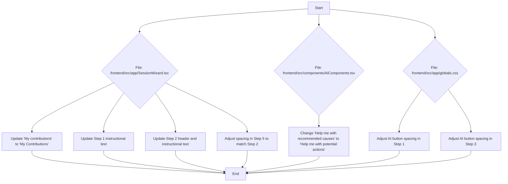

# Plan for UI and Text Updates

This document outlines the plan for updating the UI and text in the Nuudle application.

## Mermaid Diagram



## Detailed Steps:

1.  **In `frontend/src/app/SessionWizard.tsx`:**
    *   On line 663, change `My contributions` to `My Contributions`.
    *   On line 409, replace the existing text with:
        > We live in a causal universe. Every effect has a cause that precedes it. Your problem is an effect.
        >
        > List up to five causes that you think could be contributing to your problem. For each cause you identify, write down if there is a potential assumption you might be making. An assumption is something believed to be true without evidence and requires further inquiry to be considered a true cause.
    *   On line 569, change the header from `Click every action that you think might already be contributing to your problem.` to `What's your role?`.
    *   On line 570, update the italicized text to:
        > Our problems rarely exist completely outside of ourselves. We often have a role to play. Try your best to be honest about yours. Click every action that you think might already be contributing to your problem.
    *   To fix the spacing in Step 5, I will add a `mb-4` class to the `label` on line 858.

2.  **In `frontend/src/components/AIComponents.tsx`:**
    *   On line 88, change `'Help me with recommended causes'` to `'Help me with potential actions'`.

3.  **In `frontend/src/app/globals.css`:**
    *   To fix the spacing of the AI buttons in Step 1, I will add a `margin-top` to the `.cause-assumption-pair .ai-button-container` style definition. I will add a new style rule:
        ```css
        .cause-assumption-pair + .ai-button-container {
          margin-top: 1rem;
        }
        ```
    *   To fix the spacing of the AI button in Step 3, I will modify the `.ai-button-container` on line 489 to add more `margin-top`. I will change it from `margin-top: 0.25rem;` to `margin-top: 1rem;`.
    *   To fix the spacing in Step 1 between the AI buttons and the text boxes, I will modify the `.cause-assumption-pair` class on line 259 to add a `margin-bottom` of `1rem`.